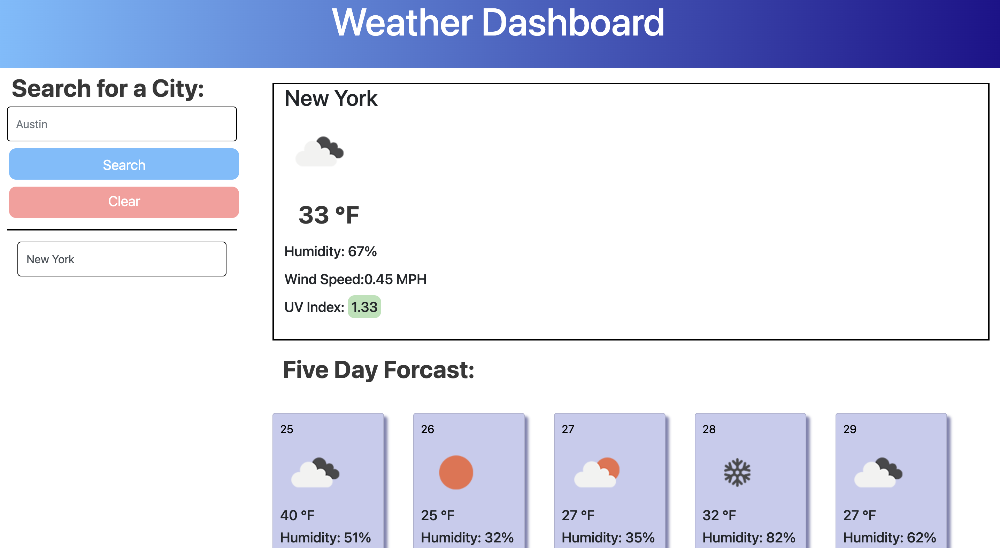

# Weather Dashboard 

#### **Name:** Honore Nelson
#### **Deployed Link:** https://matisses-goldfish.github.io/WeatherDashboard/
#### **Github Repo:** https://github.com/matisses-goldfish/WeatherDashboard/
---
    
##  Table of Contents:
* [Description](#description)
* [Deployed Application](#deployed-application)
* [Demo](#demo)
* [Technologies Used](#technologies-used)
* [Links Used](#links-used)
* [Sources](#sources)
* [Usage Information](#usage)
* [Authors](#authors)
* [License](#license)
* [Question](#questions)

## Description:
---
This application allows travelers to easily access current and forcasted weather for any specified county, state, or city. All data is pulled from the Open Weather API, which provides the weather icon, Temperature, Wind Speed, and UV index. This data is then employed with specific key words and applied to the page. Any location a user enters is then saved to local storage, appended below the search bar, and can be easily clicked to display the given weather. Axios is begin specificly employed to easily access the API with commands, such as axios.get. 

## Deployed Application:

## Demo

## Technologies Used:
* Bootstrap
* Open Weather Map
* Axios
* Figma

## Links Used:
* https://openweathermap.org/current
* https://axios-http.com/docs/intro
* https://www.figma.com/file/bQnQGRqtQ3f1J3prnzXcRr/weatherdash-wireframe?node-id=0%3A1
* https://getbootstrap.com/

## Sources
script and the use of axios is modeled after (this has been added to the physical code as well):
* Sylvia Prabudy https://github.com/sylviaprabudy/weather-dashboard
* Ryan Ellingson https://github.com/RyanEllingson/Weather-Dashboard/blob/master/assets/js/script.js
* Kimcc https://github.com/kimcc/weather-dashboard

## Usage
---
Begin Application by launching the deployed link in your browser

## Contribution Guidelines
---
Contribute using the Github workflow model!
    

## Authors
---
* **Honore Nelson** - *Initial work* - [Weather Dashboard](https://github.com/matisses-goldfish/WeatherDashboard/)
    
## License
---

This project is licensed under the  License - see the [LICENSE.md](LICENSE.md) file for details
  

## Question
---
Any additional question? 
### Contact me at:
* Gmail: honoregn@gmail.com
* Github: matisses-goldfish
